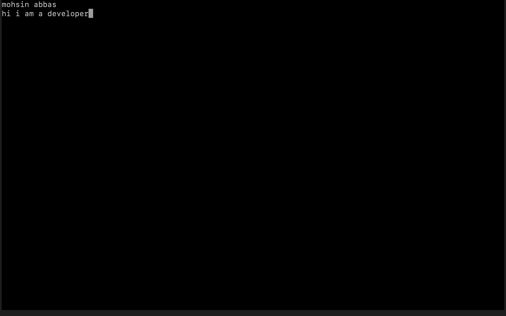
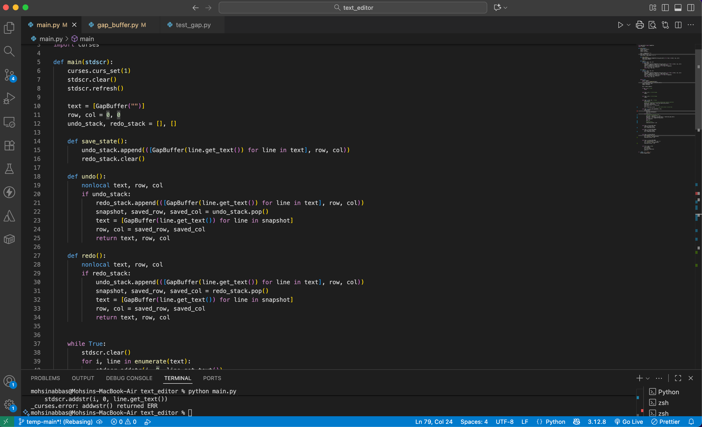

# 🧠 Text Editor from Scratch — A Deep Dive into DSA + Systems Design

> “The best way to master data structures is to *build something that actually needs them*.”

This project is a **terminal-based text editor** written completely from scratch in **Python**, built as a learning journey in **data structures**, **memory management**, and **low-level I/O handling** — the same principles that power modern editors like *Vim*, *Nano*, or *VS Code* under the hood.

---

## Day 1: Foundation Setup 
The current version is the minimal core of a working terminal editor: 
- 🧩 Built using **Python’s curses** library
- ⌨️ Supports **typing, backspace, Enter, and arrow-key navigation**
- 📍 Tracks **cursor position** manually
- 🪶 Stores text as a **list of strings**, one per line
- 🖥️ Redraws the screen on every input event.

Every keystroke updates a live buffer — nothing is handled automatically. It’s pure logic, text manipulation, and terminal control — a perfect foundation for deep DSA exploration.

## Day 2: Undo/Redo Implemented

Today’s milestone adds a **fully functional Undo/Redo system** to the terminal editor:

- 🔄 Implemented **Undo/Redo** using **two stacks** (`undo_stack` and `redo_stack`)  
- 💾 Each state stores a **deep copy of the text buffer** along with **cursor positions**  
- ⌨️ Works for **insertions, deletions, new lines**, and cursor movement  
- 🧠 Reinforces **DSA concepts** in a practical project — seeing stacks in action for the first time in a real editor  


## Day 3: Gap Buffer & Cursor-Aware Editing

Today’s milestone improves **multi-word line handling**, **Enter key behavior**, and **cursor-aware backspace**:

- 📜 **Gap Buffer per line**
  - Each line now uses a **GapBuffer** to track text and cursor internally
  - Enables **inserting, deleting, and splitting text at any cursor position**
  - Works correctly for **multi-word lines with spaces**

- ⌨️ **Enter key behavior**
  - Splits the current line at the **cursor position**
  - Text after the cursor moves to the **new line**
  - Cursor in the new line starts at **position 0** or synced with GapBuffer

- ⌫ **Backspace at cursor**
  - Deletes character at the **current cursor**, not just at the end
  - Supports **merging lines** if backspacing at the start of a line

- 🔄 **Undo/Redo improvements**
  - Cursor position now **syncs with GapBuffer** after undo/redo
  - Works for **insertions, deletions, new lines, and cursor moves**


## Day 4: Persistent Rope Tree Implementation

Today marks a **major data-structure milestone** — the editor now uses a **Persistent Rope Tree** for storing and editing text efficiently and immutably.

### 🪶 What Changed

- 🧵 Replaced the old `GapBuffer` line structure with a **Persistent Rope Tree**  
- ⚡ Each edit (insert/delete/split) now creates a **new version of the rope**, preserving history  
- 💡 Enables **memory-efficient Undo/Redo**, since old versions share unmodified tree nodes  
- 🧩 Rope nodes store:
  - `left`, `right`, and `data` fields
  - `weight` (character count in left subtree)
  - Recursive operations for **split**, **concat**, **insert**, and **delete**

### ⚙️ Editor-Level Improvements

- 🧠 Undo/Redo rebuilt to leverage **rope persistence** — instant structural rollback  
- ⌨️ Backspace, Enter, and character insertion now all run through **immutable Rope ops**
- 🧾 Each line in the editor is a separate Rope instance, allowing multi-line editing  
- 🧩 Efficient concatenation and splitting of large text blocks  

### 💡 Why Rope Tree?

Unlike normal strings or gap buffers:
- ✅ **Insertions/Deletions are O(log n)** instead of O(n)
- ✅ **Undo/Redo is structural (persistent)** — no deep copying
- ✅ **Memory is shared efficiently** between versions

This upgrade transitions the editor from *basic buffer editing* into a true **data-structure-backed text system**, similar to how **Sublime Text** or **VS Code** internally manage document history.

--

🧩 *Next up:* Persistent file saves and diff-based incremental rendering.


This makes the editor behave more like a **real-world text editor**, with correct line splitting and cursor-aware editing — the foundation for advanced text manipulation and DSA exploration.


---

## 🚀 Current Progress — Day 5: Rebalancing & Small-Leaf Optimization

Today’s update focuses on **runtime efficiency** and **memory locality** — introducing automatic **rope rebalancing** and a **small-leaf in-place optimization** for smoother text operations.

### ⚙️ What Changed

- 🔁 **Periodic Rope Rebalancer**
  - Added a `REBALANCE_THRESHOLD` counter that rebalances all ropes every few hundred edits
  - Prevents performance degradation and tree skewing during long sessions
  - Ensures average-case **O(log n)** access even after thousands of inserts/deletes  

- 🧩 **Small-Leaf Optimization**
  - Each leaf node under **64 characters** can now be **mutated directly** without splitting
  - Greatly improves typing responsiveness and reduces tree growth
  - Mimics real-world editor buffer strategies like *Vim’s small block allocator*

- 🧠 **Undo/Redo Structural References**
  - Undo/Redo now store **node references**, not deep copies
  - Structural persistence ensures instant rollbacks without memory bloat

### 🧾 Editor-Level Improvements

- ⚡ Faster character insertions and deletions  
- 🪶 Smoother typing experience with less frequent tree rebuilds  
- 🧱 Log-based rebalancing helps detect edit hotspots in logs (`editor.log`)  
- 🧩 Foundation laid for **diff-based rendering** and **persistent saves**  

---

🧩 *Next up:* Incremental rendering (diff-based screen updates) and persistent file save/load.

This phase transforms the editor from a structural demo into a **performance-oriented engine**, capable of handling long documents efficiently — all in pure Python.

---

## ⚙️ How to Run Locally (Windows + macOS/Linux)

### macOS / Linux
```bash
git clone https://github.com/mohsinakh/text-editor.git
cd text-editor
python3 main.py
```

### Windows

```powershell
git clone https://github.com/mohsinakh/text-editor.git
cd text-editor
python main.py
```
> **Note:** On Windows, you may need to install `windows-curses` first:

```powershell
pip install windows-curses
```

---


## 💻 Demo Preview (Terminal View)

Here’s a quick ASCII example of typing, cursor movement, and undo/redo:



### Code Preview:




---

## 🧠 The Learning Journey

This project isn’t about building “another text editor.”  
It’s about exploring **how editors actually work** — from input capture to undo/redo stacks.

Here’s the challenge breakdown:

| Feature | Core Concept | Data Structure / Algorithm |
|----------|---------------|-----------------------------|
| Undo / Redo | State history management | Two Stacks |
| Text Editing | Efficient string mutation | Rope Tree / Gap Buffer |
| Cursor Navigation | Linked structure of lines/chars | Doubly Linked List |
| Search / Replace | Fast substring search | KMP / Trie |
| File I/O | Text persistence | Buffered Streams |
| Auto Correct (future) | NLP-based correction | Transformer / Language Model |
| GUI Layer | Cross-platform UI | PySide6 / Qt for Python |

---

## 🧬 Planned Architecture

```text
+-----------------------+
|  Keyboard Input       |
|  (curses.getch)       |
+----------+------------+
           |
           v
+-----------------------+
|  Text Buffer          |
|  (List of Gap Buffers)  |
+----------+------------+
           |
           v
+-----------------------+
|  Undo / Redo Manager  |
|  (Two Stack Model)    |
+----------+------------+
           |
           v
+-----------------------+
|  Renderer (curses)    |
|  - Draws lines        |
|  - Moves cursor       |
+----------+------------+
           |
           v
+-----------------------+
|  File I/O Layer       |
|  (Save / Open Files)  |
+-----------------------+
```

## ✅ Controls

| Key          | Action                    |
|--------------|---------------------------|
| **Type**     | Insert text               |
| **Enter**    | New line                  |
| **Backspace**| Delete character          |
| **Arrow Keys** | Move cursor             |
| **ESC**      | Exit editor               |
| **CTRL+U**   | Undo                      |
| **CTRL+R**   | Redo                      |

---

## 🧩 Next Milestones

### 🧠 Phase 1 — DSA Foundations
- Introduce **Gap Buffer** for efficient text storage and mutation  
- Rebuild **Undo/Redo** using operation-based stacks for memory efficiency  
- Add **Search/Replace** using the **KMP algorithm**  

### 💾 Phase 2 — File Management
- Implement **file open**, **save**, and **autosave**  
- Maintain **persistent state** across sessions  

### 🪟 Phase 3 — GUI Version
- Transition to **PySide6 (Qt for Python)** for a modern desktop interface  
- Add **text styling**, **syntax highlighting**, and **undo history visualization**  

### 🤖 Phase 4 — AI Enhancements
- Integrate **AI-powered autocorrect** and smart suggestions  
- Use **Hugging Face API** or a local model for text prediction and completion

---

## 🧠 Why This Project Matters

> “Most developers use text editors daily. Few ever build one.”

This project challenges you to think beyond frameworks and libraries —  
to **understand how text editing truly works under the hood**.

Building an editor from scratch forces you to:

- 🧩 **Think like a compiler** — parsing and managing text buffers  
- ⚙️ **Think like a systems designer** — efficient I/O and memory handling  
- 🧑‍💻 **Think like an engineer** — modularity, optimization, and UX logic  

It’s one of the best ways to bridge the gap between **DSA theory** and **practical software design**.

---

## 🌐 Explore My Other Work

If you find this project interesting, check out more of my work in **AI**, **Web Development**, and **System Design**:

👉 **Portfolio:** [https://mohsinabbas.site/](https://mohsinabbas.site/)

### Featured Projects:
- 🎯 **SentimentSense** – A multimodal AI sentiment analysis platform  
- ⚽ **IPL Betting Backend** – Role-based backend system with live IPL data  
- 🧠 **FastAPI Projects** – ML model APIs and inference systems  
- 💻 **Frontend Projects** – ReactJS, Next.js, and UI engineering  

---

## 🧑‍💻 Author

**Mohsin Abbas Khan**  
🌐 [Portfolio](https://mohsinabbas.site/)  
💼 [LinkedIn](https://www.linkedin.com/in/mohsin-abbas-7252b126b/)  
🧑‍💻 [GitHub](https://github.com/mohsinakh)

---

## ⭐ Contribute / Collaborate

Contributions, feedback, and ideas are welcome!

If you'd like to:
- Implement a new **data structure variant** (e.g., Rope Tree, Gap Buffer)  
- Add an **AI layer** for autocorrect or suggestions  
- Build the **GUI version**  

→ Fork the repo, open a **PR**, or drop me a message on [LinkedIn](https://www.linkedin.com/in/mohsin-abbas-7252b126b/).

---

## 📚 License

This project is open-source under the **MIT License**.  
Feel free to learn from it, modify it, or use it in your own educational journey.

---

> 💬 *“Code that teaches you something new is worth more than code that just works.”*  
> — **Mohsin Abbas Khan**
